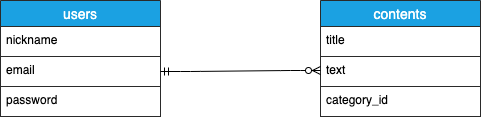

# アプリケーション名
## Slat

# アプリケーション概要
### 自分の知識を参考にしたサイトと一緒にアウトプットすることで、知識の整理・管理を行い今後の勉強・開発を効率化するアプリ。

# URL
[オリジナルアプリ](https://slat-37908.herokuapp.com/)

# テスト用アカウント
* Basic認証パスワー: administrator
* Basic認証ID: admin
* 動作テスト用メールアドレス: test1@gmail.com
* パスワード: test123

# 利用方法
## 記事投稿
1.トップページ（一覧画面）のヘッダーからログインもしくは新規登録を行う
2.ログイン後、ヘッダーの記事投稿ボタンを押し、フォームにてタイトル・内容（URL貼り付け可）・画像（任意、3枚まで）・カテゴリーを入力し作成する。
3.サイドバーに作成した記事のカテゴリーが出るので、クリックし、作成した記事名をクリックすることで内容の確認が出来る。

# アプリケーションを作成した背景
プログラミング学習を進めていく中で、私自身がコードの記述法やエラー解決等で参考にしたサイトをブックマークすることが多く、増えたブックマークからピンポイントなサイトを探すのに時間がかかることが多かった。

何故そうなるのか原因を考えた結果、ブックマークしたサイトのタイトルだけでは何の情報なのか判断し辛いからという結論に辿り着いた。

そこで自分なりに学んだ事やエラー対処法を記入しながら同時に参考にしたサイトのURLを載せて、簡単に整理出来るような環境を作れば、探し出す時間を極力減らせるのではないかと考え、このアプリを開発した。

# 洗い出した要件
[要件定義シート](https://docs.google.com/spreadsheets/d/1-bKMubvkRm4nQqD1MAJTmAhCO4pmUDD-lySqN0F13Aw/edit?usp=sharing)
# 実装した機能についての画像やGIFおよびその説明

* ユーザー管理機能

* 記事作成機能

* 記事編集機能

* 記事削除機能

# 実装予定の機能
* 検索機能（記事のタイトルを絞り込む機能）

* 共有機能（共有がONの記事は、共有一覧ページ（仮）に表示され他ユーザーも見れるようになる）

# データベース設計

# 画面遷移図

# 開発環境
* HTML
* CSS
* JavaScript
* Ruby(FW:Ruby on Rails)
* MySQL

# ローカルでの動作方法
以下コマンドを順に実行 
% git clone https://github.com/sabinuki198/slat 
% cd slat 
% bundle install 
% yarn install 
rails sにて起動、localhost:3010で動作する

# 工夫したポイント
* サイドバーに出てくるカテゴリーは、ログインユーザーの作成した記事のカテゴリーのみ出てくるので、無駄がない。
* リンクをクリックすることで直接リンク先に飛べる
* 記事作成ページに入れた改行が詳細ページにそのまま反映される（表示がズレることがない）

# テーブル設計

## users テーブル

| Column             | Type      | Options                   |
| ------------------ | --------- | ------------------------- |
| email              | string    | null: false, unique: true |
| encrypted_password | string    | null: false               |
| nickname           | string    | null: false               |

### Association

- has_many :contents

## contents テーブル

| column         | Type          | Options                        |
| -------------- | ------------- | ------------------------------ |
| title          | string        | null: false                    |
| text           | text          | null: false                    |
| category_id    | integer       | null: false                    |
| user           | references    | null: false, foreign_key: true |

### Association

- belongs_to :user